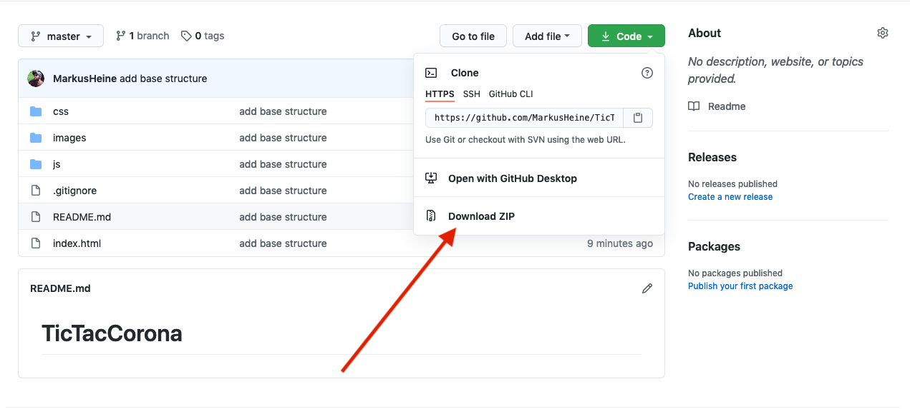

# TicTacCorona - Workshop

Moin, hier ist die Readme für unseren kleinen Workshop später.

Wir werden die Basics den Webdevelopments ankratzen, leider reicht die Zeit nicht mehr in die Tiefe zu gehen. Wir werden aber eine Idee bekommen wir es ist eine App mit html, css und JavaScript zu erstellen.

## Vorbereitung

Ihr braucht einen CodeEditor eurer Wahl. Solltet ihr noch keinen haben empfehle ich:
VsCode - der ist kostenlos und für alle Plattformen verfügbar. Ich werde den auch verwenden.

Hier ist der [Downloadlink](https://code.visualstudio.com/)

---

Ich habe für euch schon etwas Code mit einer Basisstruktur vorbereitet.

Den könnt ihr [hier](https://github.com/MarkusHeine/TicTacCorona_20201215) herunterladen,

Dafür einfach oben rechts auf den grünen Button `code` klicken die ZipFile download und in einem Order eurer Wahl entdecken.

---

Den Rest erkläre ich euch allen Später.
